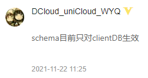
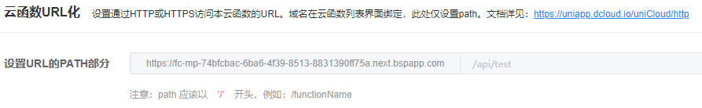

# 服务端

:::warning 请注意
服务端基于 uniCloud 开发，使用 [uniCloud 云服务空间](https://unicloud.dcloud.net.cn) 对数据库和各个云对象(api 接口)等进行管理，以目前的 uniCloud 来看，是无法以个人名义迁移至自由化部署的，具体可详见官方社区问答贴：[unicloud 独立部署-万人请求贴](https://ask.dcloud.net.cn/question/156685)，所以目前使用 uniCloud 进行开发就意味着需要放弃私有化部署。
:::

## 云服务空间初始化

> 此处不介绍云服务空间初始化向导的方式部署，而是带大家手动一步一步初始化部署云对象和数据库，旨在更好的了解具体的操作步骤

1. 鼠标悬停在项目根目录上右键点击`创建uniCloud云开发环境`，选择阿里云。（根目录下已存在 uniCloud 文件夹的忽略这一步）
   :::tip
   这里推荐使用阿里云，腾讯云和支付宝小程序云理论上也可，但是本人在搭建此框架时均基于阿里云开发，使用腾讯云或者支付宝小程序云我不能保证不会有其他意外状况发生。
   :::

2. 鼠标右键点击项目根目录下的 uniCloud 文件夹，选择 `关联云服务空间或项目`，选择绑定你指定的云服务空间。（当然首先你得有云服务空间，如果没有，请先去 [uniCloud 云服务空间](https://unicloud.dcloud.net.cn) 创建一个，阿里云支持创建一个免费的）

3. `cloudfunctions` 目录下的是云对象和公共模块，可以在`cloudfunctions` 目录鼠标右键选择 `上传所有云函数、公共模块及Actions`；也可以对云对象进行单独上传，在你要上传的云对象文件夹上鼠标右键点击 `上传部署` 即可。 `cloudfunctions/common` 目录下是云对象依赖的公共模块，公共模块写完后，需要在相关云对象中添加，例如项目中有个 `sv-handler` 全局处理模块，需要在要依赖该公共模块的云对象文件夹上鼠标右键点击 `管理公共模块和扩展库依赖`，勾选该 `sv-handler` 确定即可，这样在你的云对象下的 package.json 中就会自动添加依赖，随后在该云对象文件夹上鼠标右键点击 `使用命令行窗口打开所在目录`，运行 `npm i` 即可安装依赖至该云对象文件夹中。如果你的公共模块修改了，所依赖的云对象又多，此时无需一个一个云对象重复重新安装公共模块的步骤，只需在该公共模块的文件夹上鼠标右键点击 `更新依赖本模块的云函数` 即可自动更新所有依赖该公共模块的云对象。
   :::tip
   该第三条很重要，小白有必要根据操作步骤一步一步来
   :::

4. `database` 目录下的是数据库和扩展，在 `database` 目录下鼠标右键点击 `上传所有DB Schema(含扩展)`，即可一键上传所有数据库表和扩展；当然也可单独对表进行上传，鼠标右键指定的表文件，选择 `上传DB Schema` 即可。当然，如果数据库带有初始化数据，可以在`database` 目录鼠标右键选择 `初始化云数据库(包含Scahme与校验函数)` ，然后勾选你要进行覆盖的表，确认即可；也可单独的对指定表的后缀为 `init_data.json` 的文件鼠标右键选择 `初始化云数据库数据`。（对数据库表进行初始化数据添加的时候，请确认你的表是新表，否则可能会对已有数据造成影响）

## 云对象编写规范

> 云对象的相关详细文档请前往 [uniCloud 云对象](https://doc.dcloud.net.cn/uniCloud/cloud-obj.html)

**几个要注意的点**

1. 使用 [url 化](https://doc.dcloud.net.cn/uniCloud/http.html#cloudobject) 方式编写的云对象接口（后文统称为接口），写完后请及时更新发布到云端，不要在本地进行调试了（本地调试无法获取 [`getHttpInfo`](https://doc.dcloud.net.cn/uniCloud/cloud-obj.html#get-http-info)），建议直接在 `sv-service` 服务端的主页面请求面板中进行调试，或者使用 [Apipost](https://www.apipost.cn)、[Postman](https://www.postman.com) 等工具调试。

2. 接口统一使用 POST，返回参数统一使用公共模块 `sv-handler` 处理，可以参照测试接口 `sv-api-test` 仿写。

3. 三端内置了 `sv-configs` 模块，封装了 [uni.request](https://uniapp.dcloud.net.cn/api/request/request.html#request)，采用仿 [axios](https://www.axios-http.cn) 的编码风格，框架中也提供了相关使用示例，详情请移步 [`sv-configs 模块`](/src/plugins/sv-configs/sv-configs.md)

4. 使用 [url 化](https://doc.dcloud.net.cn/uniCloud/http.html#cloudobject) 后，在 DB Schema 中对字段设置 `defaultValue`、`forceDefaultValue` 等参数以及相关权限等都将会失效，官方解释如下：

5. 接口路径问题：<font color=#FB7299>(重点)</font>

   - 接口完整路径是由：`基础路径` + `接口路径` 组合而成
   - 基础路径：`https://fc-[服务空间 SpaceId].next.bspapp.com`，在 `云对象` -> `详情` -> `云函数 URL 化` 中可查看
   - 接口路径：`/api/[自定义接口路径]/[云对象名]`，例如：`/api/test/testList`，此处的 `/api/` 作为规范，建议所有 url 化的云对象统一加上该前缀
   - 可自行在 `云对象` -> `详情` -> `云函数 URL 化` 中手动配置接口路径：
   - 若想使用代码来配置接口路径，则要在对应的云对象 `package.json` 文件中配置 [`cloudfunction-config`](https://doc.dcloud.net.cn/uniCloud/cf-functions.html#cloudfunction-config) 项，示例：
     ```json
     "cloudfunction-config": {
      "path": "/api/test",
      // ... 其他参数
     }
     ```
   - 请求时接口的 url 示例：

     ```javascript
     import request from "@/uni_modules/sv-configs/request/index.js";

     export function testList(data) {
       return request({
         url: "/test/testList", // 基础路径 + /api 部分已在 config 内部统一配置，此处可省略；此处 /test 前的斜杠 / 也可省略，内部已做过处理
         method: "POST",
         data,
       });
     }
     ```

     更多详情请移步 [`sv-configs`](/src/plugins/sv-configs/sv-configs.md)

6. 接口权限问题：
   - 使用 [url 化](https://doc.dcloud.net.cn/uniCloud/http.html#cloudobject) 将会导致 DB Schema 中相关权限失效，对此我已在 `sv-handler` 中重新校验了 token，并重新赋予了接口权限功能，在 `sv-api-test` 等云对象的 `index.obj.js` 入口文件中都有体现，详情还请移步至云对象源码中查看与仿写。
   - 此处只贴出部分代码：
     ```javascript
     // token身份安全校验
     const WHITE_LIST = []; // 校验白名单，例如'/testList'
     // 校验名单：open开放，easy需登录，normal需API_READ只读或API_WRITE读写权限，strict需API_WRITE读写权限
     const API_MODE = {
       "/testList": "open",
       "/testAdd": "open",
       "/testUpdate": "open",
       "/testDelete": "open",
     };
     const apiPath = this.getHttpInfo().path;
     // 不是白名单的api需要进行校验
     if (!WHITE_LIST.includes(apiPath)) {
       const cToken = await handler.checkToken({
         clientInfo: this.getClientInfo(),
         token: this.getHttpInfo().headers.authorization,
         mode: API_MODE[apiPath],
       });
       if (cToken.code !== 200) {
         throw cToken;
       }
     }
     ```
